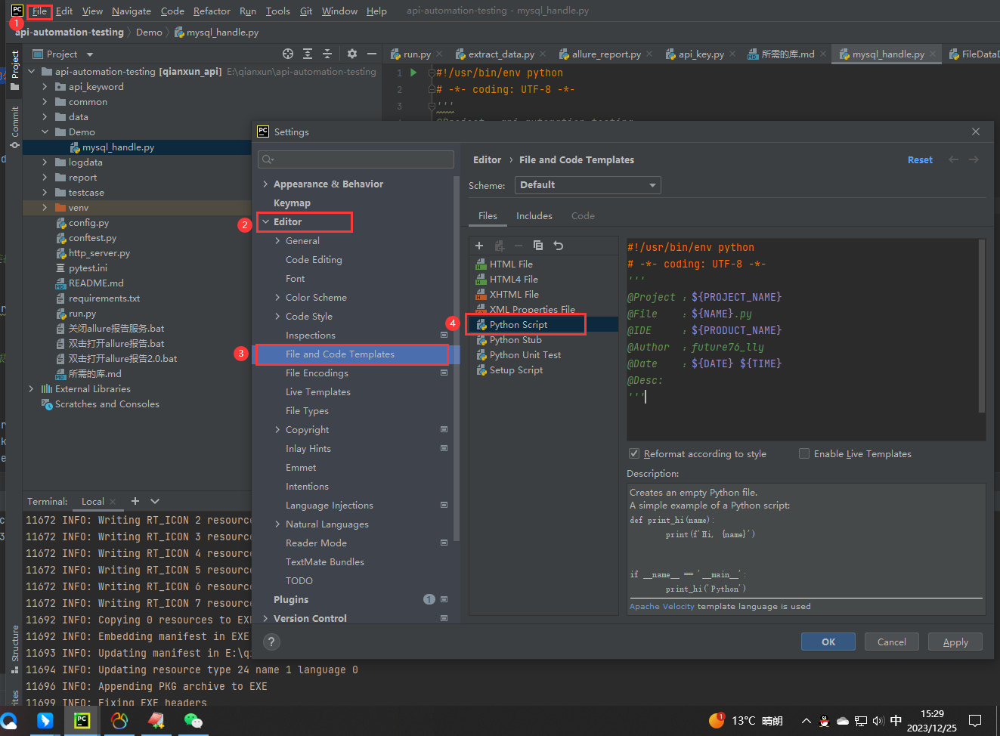

隐藏allure报告参数
找到python安装目录下的下面的文件：\Python\Lib\site-packages\allure_pytest\listener.py （或者在你的虚拟环境路径下查找）
第99行
```python
test_result.parameters.extend([]) 改成这样，去掉括号里的东西即可
```

升级 pip 到最新的版本
```python
pip install pip -U
# 或
python -m pip install --upgrade pip
```
修改pip源为清华源
```python
pip config set global.index-url https://pypi.tuna.tsinghua.edu.cn/simple
```
安装pytest
```python
pip install pytest
```
在测试
代码中添加生成 Allure 报告的相关配置和插件。
```python
pip install allure-pytest==2.11.1
```
安装requests库，jsonpath
```python
pip install requests jsonpath
```
读取excel文件.xlsx的库
```python
pip install openpyxl
```
渲染变量，使excel中的{{变量}}生效
```python
pip install jinja2
```
连接数据库
```python
pip install pymysql
```
安装基于ssh的库sshtunnel
```python
pip install sshtunnel
```
使用yaml文件
```python
pip install pyyaml
```
 全字段断言-DeepDiff
 ```python
pip install deepdiff
 ```
用例失败重跑
```python
 pip install pytest-rerunfailures
```
导出项目所拥有的第三方库: 
```python
pip freeze > requirements.txt
```
安装对应的文件的第三方库
```python
 pip install -r requirements.txt -i 镜像
```
一键安装所需要的库
```python
pip install pytest allure-pytest==2.11.1 requests jsonpath openpyxl jinja2 pymysql pyyaml deepdiff pytest-rerunfailures sshtunnel
```

nodejs下载地址：[Node.js (nodejs.org)](https://nodejs.org/en/download/)

日志管理模块
```python
pip install loguru
```
增加文件头注释

```python
#!/usr/bin/env python
# -*- coding: UTF-8 -*-
"""
@Project :${PROJECT_NAME} 
@File    :${NAME}.py
@IDE     :${PRODUCT_NAME} 
@Author  :future76_lly
@Date    :${DATE} ${TIME} 
@Desc    :
"""
```